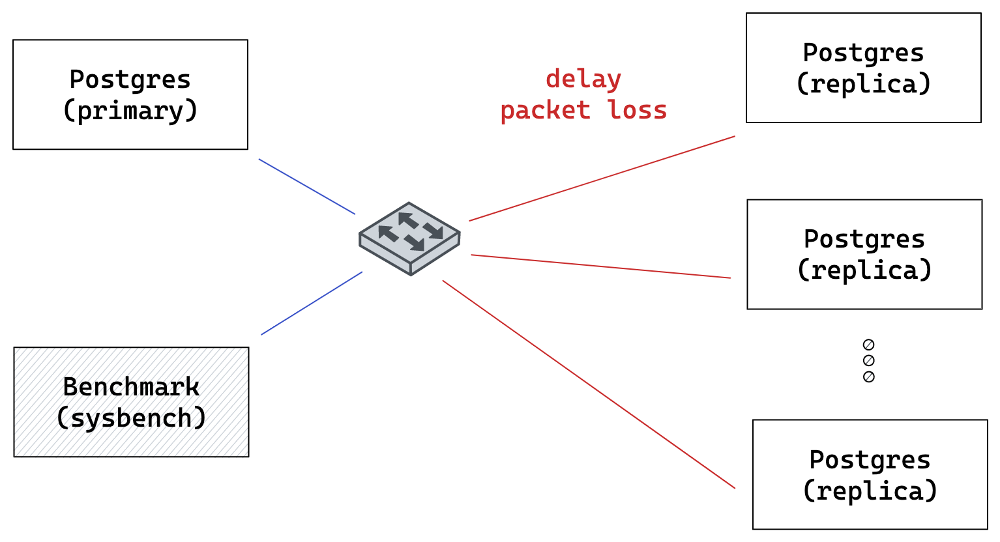

# Replicated PostgreSQL benchmarking in Containernet

Tested on Ubuntu 20.04.



## Setup

1. Install ansible

```bash
sudo apt-get update && sudo apt-get install -y ansible
```

2. Clone containernet

```bash
git clone https://github.com/containernet/containernet.git
```

3. Run ansible playbook

```bash
sudo ansible-playbook -i "localhost," -c local containernet/ansible/install.yml
```

4. Clone this repository

```bash
git clone https://github.com/Wowu/postgresql-containernet-benchmark.git
cd postgresql-containernet-benchmark
```

5. Build docker images

```
docker build -t sysbench:latest -f dockerfiles/Dockerfile.benchmark .
docker build -t tip-postgres:latest -f dockerfiles/Dockerfile.postgres .
```

5. Run benchmark

```bash
sudo ./benchmark.py --replicas 1 --output output.jsonl
```

## Useful commands

Remove all containernet containers:

```bash
docker ps --quiet --filter label=com.containernet= | xargs docker kill | xargs docker rm
```

Clean mininet network configuration:

```bash
sudo mn -c
```
